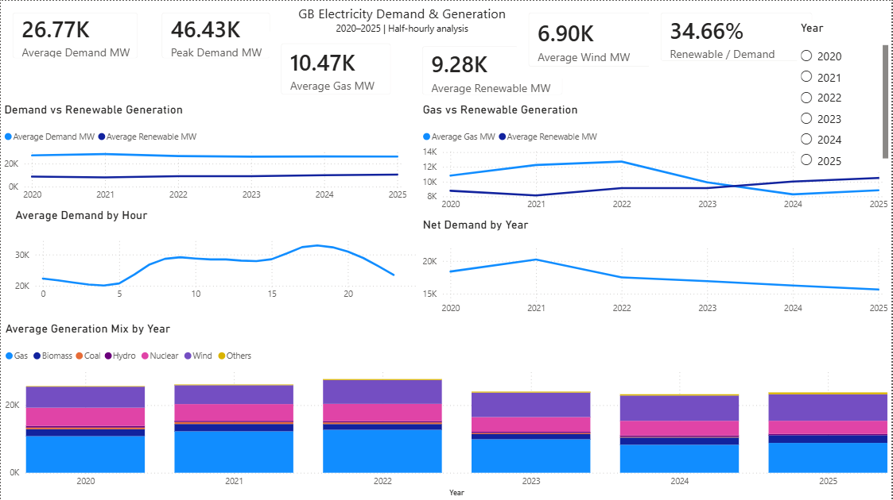
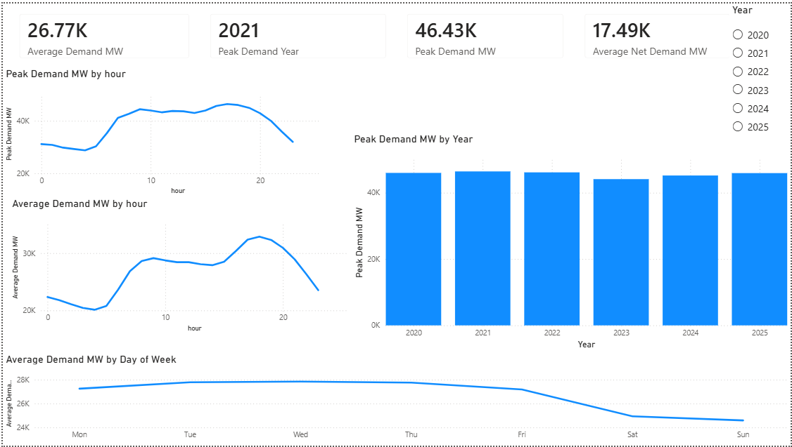
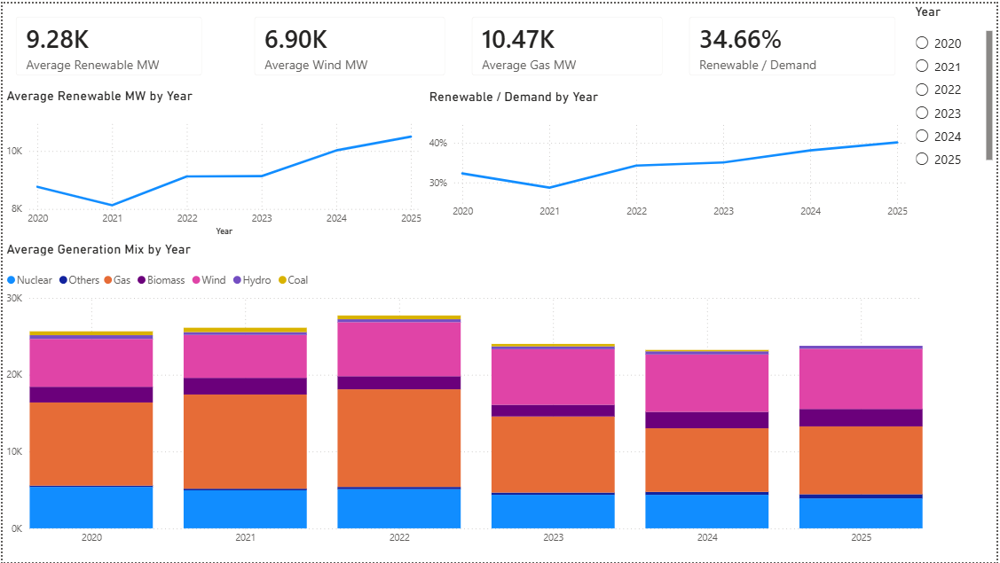
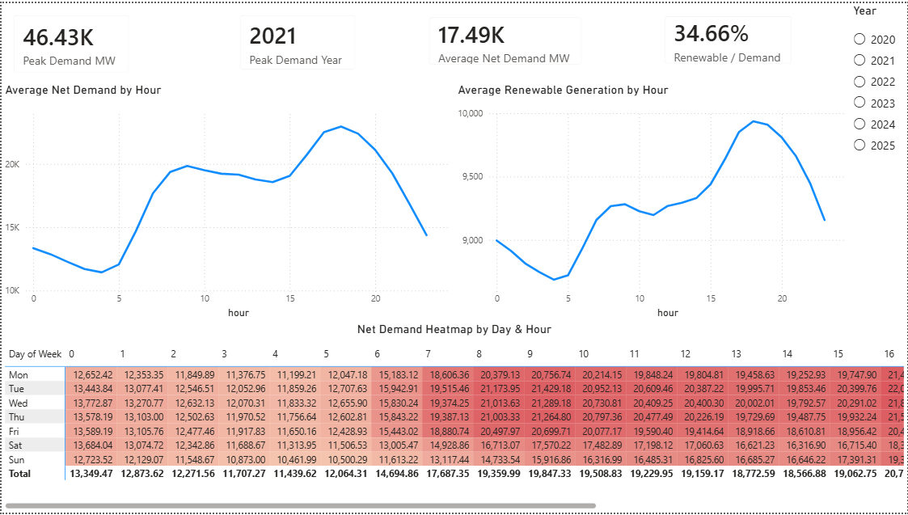

# UK Electricity Demand & Generation Analysis

## Overview

An end to end analysis of Great Britain's electricity demand and generation mix from 2020 to 2025, using half-hourly energy data to investigate demand patterns, renewable generation, gas dependency, peak demand and residual system demand.

The project combines Python-based data preparation and analysis with an interactive Power BI dashboard designed from an energy analyst/trader perspective.

### Key finding

Between 2020 and 2025, average renewable generation increased by 19.8%, while renewable generation's contribution to average electricity demand increased from 32.3% to 40.1%.

Over the same period, average net demand fell by 14.8%, while average total demand declined by only 3.7%. This indicates that increasing renewable generation was associated with a substantial reduction in residual demand.

---

# Business Questions

The analysis was designed around the following questions:

1. How has Great Britain's electricity demand changed between 2020 and 2025?
2. When does electricity demand typically peak?
3. Which year recorded the highest system demand?
4. How has the generation mix changed over time?
5. Is renewable generation increasing?
6. How has gas generation changed as renewable generation increased?
7. How has residual/net demand changed?
8. When are the most challenging periods of residual demand?

---

# Key Findings

## 1. Renewable generation increased

Average renewable generation increased from:
**8.76 GW in 2020 → 10.50 GW in 2025**
This represents an increase of approximately **19.8%**.

Renewable generation's share of average electricity demand increased from:
**32.27% → 40.13%**
This represents an increase of **7.86 percentage points**.

---

## 2. Gas generation declined substantially after 2022

Average gas generation reached its highest level in the dataset in 2022:
**12.71 GW**

By 2025, average gas generation had fallen to:
**8.83 GW**

This represents a reduction of approximately **30.5% from the 2022 peak**.
The analysis identifies a clear inverse movement between renewable generation and gas generation, although the project does not attempt to establish that renewable growth alone caused the decline in gas generation.

---

## 3. Wind generation was a major contributor to renewable growth

Average wind generation increased from:
**6.23 GW in 2020 → 7.84 GW in 2025**
An increase of approximately **25.9%**.
This makes wind a significant contributor to the overall increase in renewable generation observed during the study period.

---

## 4. Residual demand declined faster than total demand

Average total electricity demand changed from:
**27.15 GW in 2020 → 26.16 GW in 2025**
A decline of approximately **3.7%**.

However, average net demand changed from:
**18.39 GW → 15.66 GW**
A much larger decline of approximately **14.8%**.

This difference suggests that increasing renewable generation reduced the amount of demand remaining to be met by conventional generation.

---

## 5. The evening period is the key demand window

Average electricity demand was highest at approximately:
**18:00 — 32.89 GW**

Average net demand was also highest at:
**18:00 — 22.95 GW**

The highest-demand hours were concentrated between approximately **16:00 and 20:00**.
This identifies the evening period as an important operational window for monitoring residual demand and system conditions.

---

## 6. Peak system demand occurred in 2021

The highest recorded demand in the dataset was:
**46,433 MW in 2021**
Peak demand subsequently remained broadly within the same range, rather than following a consistent upward trend.

---

#  Data Sources

This project combines two publicly available Great Britain electricity-system datasets.

### Elexon — FUELHH

**Dataset:** FUELHH — Half-hourly generation outturn by fuel type

Used for generation-by-fuel analysis, including:

- Gas
- Wind
- Nuclear
- Biomass
- Hydro
- Coal
- Oil
- Pumped storage
- Other generation

The FUELHH dataset provides half-hourly generation outturn by fuel type through Elexon's API Developer Portal. :contentReference[oaicite:0]{index=0}

### National Energy System Operator (NESO) — Historic Demand Data

**Dataset:** Historic Demand Data

Used for electricity-demand analysis and demand validation, including:

- National demand
- Transmission system demand
- Settlement date
- Settlement period

NESO describes the dataset as historic electricity demand and related system outturn data, with the data available at half-hourly settlement-period resolution. The dataset is published under the **NESO Open Data Licence**. :contentReference[oaicite:1]{index=1}

### Coverage

- **Observations:** 105,169 half-hourly records
- **Features:** 41 columns in the final analytical dataset
- **Period:** 2020–2025
- **Geography:** Great Britain
- **Granularity:** Half-hourly
- **Demand:** MW
- **Generation:** MW

The datasets were aligned using UK settlement dates, settlement periods and constructed UK datetimes before being combined for analysis.

### Derived Metrics

The combined dataset was used to calculate:

- Renewable share
- Net demand
- Gas share
- Renewable demand coverage
- Gas demand coverage
- Demand bands
- Peak indicators
- Seasonal classifications
---

# Methodology

## 1. Data collection

Raw electricity demand and generation datasets were collected and stored within the project data directory.

The project separates raw, processed and output data to maintain a reproducible workflow.


```text
data/
├── raw/
├── processed/
└── ...
```

2. Data validation

The datasets were checked for:

Missing values
Duplicate timestamps
Duplicate settlement periods
Date coverage
Settlement-period consistency
Data types
Quality flags
Alignment between demand and generation timestamps

3. Data transformation
The half-hourly datasets were transformed into a common analytical structure.

Key transformations included:

Timestamp construction
UK datetime handling
Settlement-period conversion
Date extraction
Hour extraction
Day-of-week classification
Month and season classification
Weekend identification
Generation aggregation
Renewable generation calculation
Net demand calculation

4. Feature engineering

Additional analytical variables were created, including:

gas_share
renewable_share
net_demand_mw
renewable_demand_coverage
gas_demand_coverage
demand_band
demand_band_order
is_peak_global
is_peak_year
season

These features enabled analysis beyond simple demand and generation totals.

Tools & Technologies:
Python
pandas
NumPy
Matplotlib
Jupyter
requests

Python was used for:

Data ingestion
Cleaning
Validation
Transformation
Feature engineering
Exploratory analysis
Final insight extraction
Power BI

Power BI was used to build an interactive dashboard containing:

KPI cards
Time-series analysis
Generation mix analysis
Demand analysis
Renewable analysis
Peak-demand analysis
Operational heatmaps
Year filtering
Git / GitHub

Git is used for project version control and portfolio presentation.

Dashboard

The Power BI dashboard is organised into four analytical pages.

1. Executive Overview

Provides a high-level view of:

Electricity demand
Peak demand
Gas generation
Renewable generation
Wind generation
Renewable demand coverage
Demand patterns
Generation mix



2. Demand & Peak Analysis

Focuses on:

Average demand
Peak demand
Peak-demand year
Net demand
Demand by hour
Peak demand by year
Demand by day of week



3. Generation & Renewable Analysis

Focuses on:

Renewable generation trends
Renewable share
Wind generation
Gas generation
Generation mix by year



4. Operational Patterns

Focuses on:

Net demand by hour
Renewable generation by hour
Net-demand patterns across day and hour
Operational periods of elevated residual demand
Business / Energy Trading Relevance



The analysis is designed to demonstrate how energy data can be used to identify operational patterns and potential market-relevant signals.

The most important observation is that total demand and residual demand behave differently.
While total demand changed relatively little between 2020 and 2025, net demand declined substantially as renewable generation increased.
The analysis also identifies the evening period as a key residual-demand window.

For an energy analyst or trader, these patterns can support further investigation into:

Gas generation requirements
Renewable intermittency
Residual demand
Peak periods
System flexibility
Intraday demand patterns
Generation mix changes
Potential price and balancing-market relationships

This project does not attempt to predict electricity prices or establish causal relationships between generation and market prices.

Limitations

Several factors are outside the scope of this analysis.

The project does not directly model:

Electricity prices
Weather conditions
Fuel prices
Interconnector flows
Generator outages
Plant availability
Carbon prices
Electricity imports and exports
Balancing-market actions

Therefore, observed relationships should be interpreted as descriptive relationships rather than causal conclusions.

For example, the decline in gas generation occurring alongside increased renewable generation does not prove that renewable growth alone caused the reduction in gas generation.

Future Work

Potential extensions include:

1. Electricity price analysis

Combine demand and generation data with day-ahead or intraday electricity prices to investigate:

How do renewable output and residual demand relate to GB electricity prices?

2. Weather integration

Introduce:

Wind speed
Solar irradiance
Temperature

to investigate the relationship between weather conditions and renewable output.

3. Price forecasting

Develop a forecasting model using:

Demand
Renewable generation
Gas generation
Weather
Time features
Historical prices

4. Trading signals

Develop a rule-based or machine-learning framework to identify periods where:
High demand
Low renewable output
High gas dependency
may correspond to elevated price risk.

Project Structure
uk_energy_analysis/
│
├── dashboard/
│   └── UK_Energy_Analysis.pbix
│
├── data/
│   ├── raw/
│   └── processed/
│
├── docs/
│
├── notebooks/
│   ├── 01_data_inspection.ipynb
│   ├── ...
│   ├── 08_energy_analysis.ipynb
│   ├── 09_final_feature_engineering.ipynb
│   └── 10_final_insights.ipynb
│
├── outputs/
│
├── scripts/
│
├── requirements.txt
├── README.md
└── .gitignore
Conclusion

This project demonstrates an end to end data analytics workflow using real electricity system data.

The analysis combines:

Data collection → validation → cleaning → feature engineering → exploratory analysis → business analysis → Power BI visualisation

The main finding is that Great Britain's electricity system became increasingly renewable between 2020 and 2025, while residual demand and average gas generation declined. However, a pronounced evening residual-demand peak remained, highlighting the continued importance of understanding system flexibility and peak-period generation requirements.

### Next action

Open:
```text
uk_energy_analysis
└── README.md
```